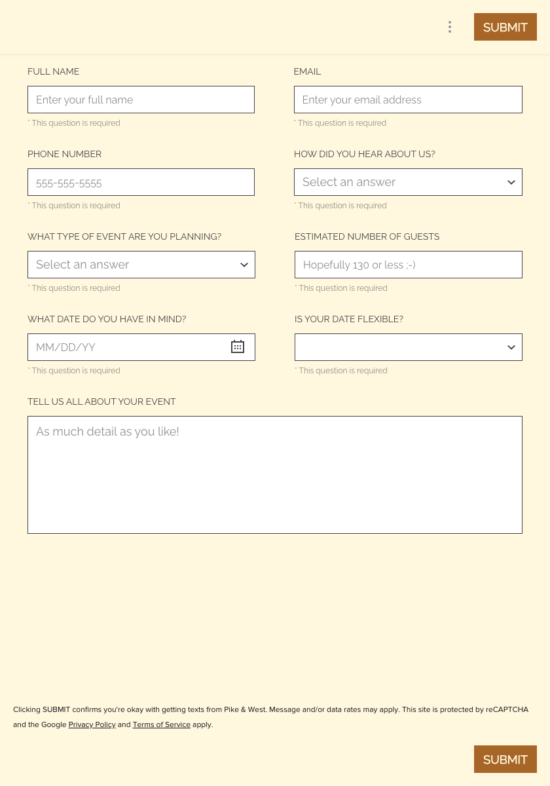
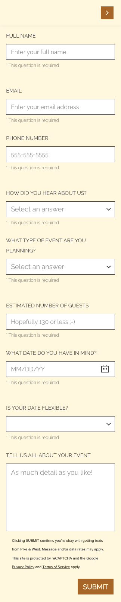

# Contact Form Shimmer Documentation

This document provides comprehensive measurements and specifications for the HubSpot contact form embed used on the Pike & West contact page. These measurements are used to create pixel-accurate shimmer loading states.

## Form Source

- **URL:** `https://portal.pikeandwest.com/public/inquiry`
- **Provider:** HubSpot (via Pike & West portal)
- **Form ID:** `1-Lead_Capture_Form__Contact_Us`

## Breakpoints

The form has two responsive layouts:

| Layout               | Viewport Width | Container Width | Container Height |
|----------------------|----------------|-----------------|------------------|
| Desktop (two-column) | > 868px        | 840px           | 960px            |
| Mobile (one-column)  | <= 868px       | 324px           | 1400px           |

### Shimmer Breakpoint

The shimmer CSS uses `$shimmer-breakpoint: 868px` to switch between layouts, matching the HubSpot form's internal responsive breakpoint.

## Desktop Layout (840px viewport)



### Container Dimensions

- **Total width:** 840px
- **Content padding:** 42px left, 42px right
- **Content area:** 756px (840 - 42 - 42)
- **Column width:** ~348px each
- **Column gap:** 60px
- **Row gap:** 24px (between field groups)

### Field Measurements

| Field            | Label                                | X   | Y   | Width | Height |
|------------------|--------------------------------------|-----|-----|-------|--------|
| Full Name        | FULL NAME                            | 42  | 131 | 347   | 42     |
| Email            | EMAIL                                | 449 | 131 | 349   | 42     |
| Phone Number     | PHONE NUMBER                         | 42  | 257 | 347   | 42     |
| How Did You Hear | HOW DID YOU HEAR ABOUT US?           | 449 | 257 | 349   | 42     |
| Event Type       | WHAT TYPE OF EVENT ARE YOU PLANNING? | 42  | 383 | 348   | 42     |
| Guest Count      | ESTIMATED NUMBER OF GUESTS           | 450 | 383 | 348   | 42     |
| Event Date       | WHAT DATE DO YOU HAVE IN MIND?       | 42  | 509 | 348   | 42     |
| Date Flexible    | IS YOUR DATE FLEXIBLE?               | 450 | 509 | 348   | 42     |
| Message          | TELL US ALL ABOUT YOUR EVENT         | 42  | 635 | 756   | 180    |

### Row Structure (Desktop)

| Row | Fields                    | Y Position |
|-----|---------------------------|------------|
| 1   | Full Name, Email          | 109-173    |
| 2   | Phone, How Did You Hear   | 235-299    |
| 3   | Event Type, Guest Count   | 361-425    |
| 4   | Event Date, Date Flexible | 487-551    |
| 5   | Message (full width)      | 613-815    |

### Button Positions

| Element         | X   | Y    | Width | Height |
|-----------------|-----|------|-------|--------|
| Submit (header) | 724 | 20   | 96    | 42     |
| Submit (footer) | 724 | 1138 | 96    | 42     |

## Mobile Layout (324px viewport)



### Container Dimensions

- **Total width:** 324px
- **Content padding:** 16px left, 16px right
- **Content area:** 292px (324 - 16 - 16)
- **Single column layout**
- **Row gap:** ~24px between fields

### Field Measurements

| Field            | Label                                | X  | Y    | Width | Height |
|------------------|--------------------------------------|----|------|-------|--------|
| Full Name        | FULL NAME                            | 16 | 117  | 292   | 42     |
| Email            | EMAIL                                | 16 | 263  | 292   | 42     |
| Phone Number     | PHONE NUMBER                         | 16 | 389  | 292   | 42     |
| How Did You Hear | HOW DID YOU HEAR ABOUT US?           | 16 | 515  | 292   | 42     |
| Event Type       | WHAT TYPE OF EVENT ARE YOU PLANNING? | 16 | 641  | 292   | 42     |
| Guest Count      | ESTIMATED NUMBER OF GUESTS           | 16 | 834  | 292   | 42     |
| Event Date       | WHAT DATE DO YOU HAVE IN MIND?       | 16 | 960  | 292   | 42     |
| Date Flexible    | IS YOUR DATE FLEXIBLE?               | 16 | 1086 | 292   | 42     |
| Message          | TELL US ALL ABOUT YOUR EVENT         | 16 | 1232 | 292   | 180    |

### Vertical Spacing (Mobile)

- Field height: 42px
- Label height: ~20px
- Hint text height: ~16px
- Gap between fields: ~24px
- Total height: ~1400px

## Element Specifications

### Input Fields

```scss
height: 42px;
border-radius: 0; // HubSpot uses square corners
border: 1px solid rgba(0, 0, 0, 0.15);
background: white;
padding: 0 12px;
```

### Dropdowns (Select)

Same dimensions as input fields, with dropdown arrow icon on right side.

### Textarea

```scss
width: 100%; // Full width in both layouts
height: 180px;
border-radius: 0;
border: 1px solid rgba(0, 0, 0, 0.15);
background: white;
padding: 12px;
```

### Labels

```scss
font-size: 11px;
font-weight: 600;
text-transform: uppercase;
letter-spacing: 0.5px;
color: #434345;
margin-bottom: 8px;
```

### Hint Text ("This question is required")

```scss
font-size: 12px;
color: #c17f59; // Gold/orange color
margin-top: 4px;
```

### Submit Button

```scss
width: 96px;
height: 42px;
background: #aa6e0b; // Pike & West gold
color: white;
border-radius: 4px;
font-weight: 600;
text-transform: uppercase;
```

## Shimmer Implementation

The shimmer skeleton uses these measurements to create a pixel-accurate loading state:

### Desktop Shimmer Grid

```scss
.contact-shimmer__row {
  display: grid;
  grid-template-columns: 1fr 1fr;
  gap: 60px; // Column gap
}
```

### Mobile Shimmer Grid

```scss
@media (max-width: 868px) {
  .contact-shimmer__row {
    grid-template-columns: 1fr;
    gap: 24px;
  }
}
```

### Shimmer Block Sizes

```scss
.shimmer-block--label {
  width: 50%;
  max-width: 200px;
  height: 20px;
}

.shimmer-block--input {
  width: 100%;
  height: 42px;
}

.shimmer-block--textarea {
  width: 100%;
  height: 180px;
}

.shimmer-block--hint {
  width: 35%;
  max-width: 140px;
  height: 16px;
  margin-top: 4px;
}

.shimmer-block--button {
  width: 96px;
  height: 42px;
  border-radius: 4px;
}

.shimmer-block--icon {
  width: 42px;
  height: 42px;
}

.shimmer-block--disclaimer {
  width: 100%;
  max-width: 600px;
  height: 32px; // 48px on mobile
}
```

## Files

| File                                         | Purpose                                   |
|----------------------------------------------|-------------------------------------------|
| `layouts/partials/contact-form-shimmer.html` | Hugo partial template                     |
| `assets/scss/_contact.scss`                  | Shimmer styles (`.contact-shimmer` block) |
| `assets/js/main.js`                          | `initContactShimmer()` function           |

## Related Documentation

- [Contact Page Layout](../architecture/decisions/ADR-006-contact-form-shimmer.md) - Architecture decision record
- [CSS Mapping](../webflow-to-hugo-css-mapping.md) - Webflow to Hugo style mapping

---

_Last updated: 2026-01-23_
_Measurements captured via Playwright automation_
