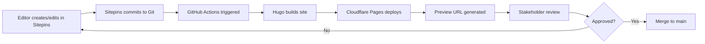

# Sitepins CMS Optimization Plan

> Comprehensive strategy for integrating and optimizing Sitepins visual CMS with the Pike & West Hugo site.

**Last Updated:** 2026-01-20
**Status:** Planning

## Executive Summary

[Sitepins](https://sitepins.com/) is a Git-based headless CMS designed specifically for static site generators like Hugo. It provides a visual editing interface without requiring configuration or schema setup. This plan outlines the integration strategy, optimization opportunities, and improvements for visual CMS support on the Pike & West site.

---

## Current Site Assessment

### Strengths for Sitepins Integration

| Feature | Status | Notes |
|---------|--------|-------|
| Data-driven content | Ready | All homepage sections use YAML data files |
| Section toggle architecture | Ready | Homepage has `sections:` flags for feature control |
| Consistent front matter | Ready | Clear YAML patterns for pages and posts |
| Separation of concerns | Ready | Content separate from configuration |
| Clean Git state | Ready | No existing CMS conflicts |

### Content Structure Overview

```
content/
├── _index.md              # Homepage (7 sections via data files)
├── about.md               # About page
├── contact.md             # Contact page
├── gallery-application.md # Artist application
└── blog/
    ├── _index.md          # Blog listing
    └── *.md               # Blog posts (2 current)

data/
├── hero.yaml              # Hero section content
├── events.yaml            # Event types grid
├── about.yaml             # About section blocks
├── cta_banner.yaml        # Call-to-action banner
└── venue_gallery.yaml     # Venue gallery section
```

---

## Phase 1: Sitepins Integration Setup

### 1.1 Repository Connection

**Steps:**
1. Register at [sitepins.com](https://sitepins.com/)
2. Connect GitHub repository (`cneller/pikeandwest.com`)
3. Configure content folders:
   - **Content folder:** `content/`
   - **Data folder:** `data/`
   - **Media folder:** `static/images/`
   - **Config folder:** `config/`

**No configuration files needed** - Sitepins auto-detects folder structure.

### 1.2 User Role Setup

| Role | Permissions | Users |
|------|-------------|-------|
| Admin | Full access, settings, user management | Developer |
| Editor | Edit content, commit changes | Content team |
| Viewer | Read-only preview | Stakeholders |

### 1.3 AI Assistant Integration (Optional)

Connect OpenAI API key for:
- Content generation assistance
- Blog post drafting
- Meta description optimization
- Alt text suggestions

---

## Phase 2: Content Optimization

### 2.1 Front Matter Standardization

Create consistent front matter schemas across content types:

**Pages Schema:**
```yaml
---
title: string (required)
description: string (required, 150-160 chars for SEO)
layout: string (optional)
type: string (optional)
og_image: string (optional)
sections:
  section_name: boolean
---
```

**Blog Posts Schema:**
```yaml
---
title: string (required)
description: string (required)
date: date (required, YYYY-MM-DD)
draft: boolean
author: string (default: "Pike & West")
categories: array
tags: array
image: string (required)
image_alt: string (required)
keywords: array (optional)
---
```

### 2.2 Data File Optimization

Restructure data files for better CMS editing experience:

**Current:** Nested complex structures
**Optimized:** Flattened with clear field labels

**Example - `data/hero.yaml`:**
```yaml
# CMS-friendly structure with clear labels
hero:
  enabled: true

  # Headlines (displayed sequentially)
  title_line_1: "Pike"
  title_line_2: "&"
  title_line_3: "West"

  tagline: "Art and Life. Life and Art. Life as Art."

  # Call to Action
  cta:
    text: "Contact Us"
    url: "/contact"

  # Background Media
  background:
    image: "images/hero/venue-exterior.jpg"
    alt: "Pike & West venue exterior"

  # Overlay Content
  foreground:
    image: "images/hero/disco-ball.png"
    alt: "Decorative disco ball"
```

### 2.3 Shortcode Library

Create reusable shortcodes for common content patterns:

**Location:** `layouts/shortcodes/`

| Shortcode | Purpose | Parameters |
|-----------|---------|------------|
| `cta-button` | Styled CTA button | text, url, style |
| `image-gallery` | Responsive image grid | folder, columns |
| `contact-card` | Contact info display | phone, email, address |
| `event-highlight` | Featured event card | title, image, description |
| `testimonial` | Customer testimonial | quote, author, event_type |

**Example shortcode template:**
```go-html-template
{{/* layouts/shortcodes/cta-button.html */}}
{{ $text := .Get "text" | default "Learn More" }}
{{ $url := .Get "url" | default "/" }}
{{ $style := .Get "style" | default "primary" }}

<a href="{{ $url }}" class="btn btn--{{ $style }}">
  {{ $text }}
</a>
```

---

## Phase 3: Visual CMS Support Improvements

### 3.1 Live Preview Enhancement

**Current Gap:** Hugo rebuilds required to see changes.

**Solutions:**

1. **Cloudflare Pages Preview Deployments**
   - Auto-deploy preview for each Git commit
   - Shareable preview URLs for client review
   - Branch-based previews

2. **Local Development Preview**
   ```bash
   # Hugo server with live reload
   hugo server -D --navigateToChanged
   ```

3. **Sitepins Visual Preview**
   - Enable in-CMS preview mode
   - Configure preview URL pattern

### 3.2 Visual Section Builder

**Concept:** Enable non-technical users to compose pages from pre-built sections.

**Implementation Strategy:**

1. **Section Toggle System** (Already exists on homepage)
   ```yaml
   sections:
     hero: true
     venue_gallery: true
     events: true
     about: true
     cta_banner: true
   ```

2. **Extend to All Pages:**
   - Create section partials as modular blocks
   - Add section ordering via data files
   - Create section-specific data files

3. **Section Library:**
   | Section | Data Source | Customizable Fields |
   |---------|-------------|---------------------|
   | Hero | `hero.yaml` | Titles, tagline, CTA, images |
   | Event Grid | `events.yaml` | Heading, event types, CTA |
   | About Blocks | `about.yaml` | Subtitle, text, CTA, image |
   | CTA Banner | `cta_banner.yaml` | Heading, text, CTA |
   | Testimonials | `testimonials.yaml` | Quotes, authors |
   | Contact Info | `site.yaml` | Address, phone, hours |

### 3.3 Media Library Optimization

**Current State:** Images in `static/images/` with manual organization.

**Improvements:**

1. **Structured Folder Organization:**
   ```
   static/images/
   ├── hero/           # Hero section images
   ├── venue/          # Venue photography
   ├── events/         # Event type images
   │   ├── weddings/
   │   ├── corporate/
   │   └── parties/
   ├── blog/           # Blog post images
   ├── team/           # Team member photos
   └── brand/          # Logo variants, icons
   ```

2. **Image Naming Convention:**
   ```
   {category}-{description}-{size}.{format}
   venue-main-hall-1920w.jpg
   event-wedding-table-setting-800w.webp
   ```

3. **Alt Text Documentation:**
   Create `data/image-alts.yaml` for centralized alt text:
   ```yaml
   images:
     hero/venue-exterior.jpg: "Pike & West venue exterior at dusk"
     venue/main-hall.jpg: "Main event hall with hardwood floors"
   ```

### 3.4 External Image CDN Integration

For advanced media optimization, consider integrating:

**Option A: [ImageKit](https://imagekit.io/)**
- Real-time image optimization
- Automatic WebP/AVIF conversion
- URL-based transformations
- CDN delivery

**Option B: [Cloudinary](https://cloudinary.com/)**
- AI-powered cropping
- Video support
- Extensive transformation API

**Hugo Integration Pattern:**
```go-html-template
{{ $cdnBase := "https://ik.imagekit.io/pikeandwest/" }}
{{ $img := .Params.image }}

<picture>
  <source srcset="{{ $cdnBase }}{{ $img }}?tr=w-800,f-webp" type="image/webp">
  
</picture>
```

---

## Phase 4: Workflow Automation

### 4.1 Content Workflow



### 4.2 GitHub Actions Workflow

```yaml
# .github/workflows/preview.yml
name: Build Preview

on:
  push:
    branches-ignore:
      - main

jobs:
  build:
    runs-on: ubuntu-latest
    steps:
      - uses: actions/checkout@v4

      - name: Setup Hugo
        uses: peaceiris/actions-hugo@v3
        with:
          hugo-version: 'latest'
          extended: true

      - name: Build
        run: hugo --gc --minify

      - name: Deploy to Cloudflare Pages
        uses: cloudflare/pages-action@v1
        with:
          apiToken: ${{ secrets.CLOUDFLARE_API_TOKEN }}
          accountId: ${{ secrets.CLOUDFLARE_ACCOUNT_ID }}
          projectName: pikeandwest
          directory: public
```

### 4.3 Scheduled Content Publishing

For time-sensitive content (blog posts, event announcements):

```yaml
# .github/workflows/scheduled-publish.yml
name: Scheduled Publish

on:
  schedule:
    - cron: '0 6 * * *'  # Daily at 6 AM UTC

jobs:
  publish:
    runs-on: ubuntu-latest
    steps:
      - uses: actions/checkout@v4
      - name: Setup Hugo
        uses: peaceiris/actions-hugo@v3
        with:
          hugo-version: 'latest'
          extended: true
      - name: Build with future content
        run: hugo --gc --minify
      - name: Deploy
        # Deploy step
```

---

## Phase 5: SEO & Performance Optimization

### 5.1 SEO Content Fields

Enhance front matter for SEO:

```yaml
---
title: "Page Title"
description: "Meta description (150-160 characters)"

# SEO Fields
seo:
  title: "Custom SEO Title | Pike & West"  # Override page title
  canonical: "/original-url"                # If content moved
  noindex: false                            # Exclude from search

# Open Graph
og:
  title: "Social Share Title"
  description: "Description for social cards"
  image: "images/og/page-share.jpg"
  type: "website"

# Schema.org
schema:
  type: "EventVenue"
  priceRange: "$$$$"
---
```

### 5.2 Performance Checklist

| Optimization | Implementation | Status |
|--------------|----------------|--------|
| Image lazy loading | `loading="lazy"` on images | Implemented |
| WebP conversion | Hugo image processing | Implemented |
| Critical CSS | Inline above-fold styles | Pending |
| Preload fonts | `<link rel="preload">` | Pending |
| Minify HTML/CSS/JS | `hugo --minify` | Implemented |
| Gzip/Brotli | Cloudflare auto-compression | Implemented |

### 5.3 Lighthouse Targets

| Metric | Target | Current |
|--------|--------|---------|
| Performance | > 95 | TBD |
| Accessibility | > 95 | TBD |
| Best Practices | > 95 | TBD |
| SEO | > 95 | TBD |

---

## Phase 6: Advanced Visual CMS Features

### 6.1 Component-Based Editing (Future)

**Concept:** Allow editors to build pages using drag-and-drop components.

**Implementation Path:**

1. **Define Component Library:**
   ```yaml
   # data/components.yaml
   components:
     - id: hero-split
       name: "Split Hero"
       fields: [title, subtitle, image, cta]

     - id: feature-grid
       name: "Feature Grid"
       fields: [heading, items[]]

     - id: testimonial-slider
       name: "Testimonial Slider"
       fields: [testimonials[]]
   ```

2. **Page Composition via Front Matter:**
   ```yaml
   ---
   title: "Custom Landing Page"
   layout: "modular"
   components:
     - type: hero-split
       data:
         title: "Welcome"
         subtitle: "To Pike & West"
         image: "images/hero/landing.jpg"
         cta:
           text: "Book a Tour"
           url: "/contact"

     - type: feature-grid
       data:
         heading: "Our Spaces"
         items:
           - title: "Main Hall"
             image: "images/venue/main-hall.jpg"
   ---
   ```

3. **Modular Layout Template:**
   ```go-html-template
   {{/* layouts/_default/modular.html */}}
   {{ define "main" }}
     {{ range .Params.components }}
       {{ partial (printf "components/%s.html" .type) .data }}
     {{ end }}
   {{ end }}
   ```

### 6.2 Content Preview Cards

For blog posts and event pages, create rich preview cards:

```go-html-template
{{/* partials/preview-card.html */}}
<article class="preview-card">
  {{ with .Params.image }}
    
  {{ end }}
  <div class="preview-card__content">
    <h3>{{ .Title }}</h3>
    <p>{{ .Description }}</p>
    <a href="{{ .RelPermalink }}">Read More</a>
  </div>
</article>
```

### 6.3 Form Builder Integration

**Current State:** HoneyBook embedded forms.

**Enhancement Options:**

1. **Keep HoneyBook** - Already integrated, handles CRM
2. **Add Simple Forms** - For newsletter signup, quick inquiries
3. **Sitepins Form Handler** - If Sitepins adds form support

**Newsletter Form Example:**
```go-html-template
<form action="https://api.sitepins.com/forms/newsletter" method="POST">
  <input type="email" name="email" placeholder="Your email" required>
  <button type="submit">Subscribe</button>
</form>
```

---

## Implementation Roadmap

### Phase 1: Foundation (Week 1)
- [ ] Register Sitepins account
- [ ] Connect GitHub repository
- [ ] Configure content/data/media folders
- [ ] Set up user roles
- [ ] Test basic editing workflow

### Phase 2: Content Optimization (Week 2)
- [ ] Standardize front matter schemas
- [ ] Optimize data file structures
- [ ] Create shortcode library
- [ ] Document content patterns

### Phase 3: Visual Enhancements (Week 3)
- [ ] Set up preview deployments
- [ ] Extend section toggle system
- [ ] Organize media library
- [ ] Create alt text documentation

### Phase 4: Automation (Week 4)
- [ ] Configure GitHub Actions workflows
- [ ] Set up scheduled publishing
- [ ] Document workflow for content team
- [ ] Create training materials

### Phase 5: Advanced Features (Future)
- [ ] Evaluate component-based editing
- [ ] Consider CDN integration
- [ ] Monitor Sitepins feature updates
- [ ] Gather editor feedback and iterate

---

## Brainstormed Improvements for Visual CMS Support

### Quick Wins

1. **Rich Field Descriptions** - Add helper text to all front matter fields
2. **Image Dimension Guidelines** - Document required sizes per context
3. **Content Templates** - Pre-filled templates for common content types
4. **Validation Rules** - Character limits, required fields, format patterns

### Medium Effort

5. **Live Preview Widget** - Embed site preview in CMS interface
6. **Content Scheduling UI** - Visual calendar for planned publications
7. **SEO Score Indicator** - Real-time SEO quality feedback
8. **Image Cropping Tool** - In-CMS image editing for focal points

### High Impact (Requires Development)

9. **Visual Page Builder** - Drag-and-drop section arrangement
10. **A/B Testing Support** - Content variants for testing
11. **Multi-language Support** - i18n content management
12. **Revision Comparison** - Side-by-side content diff view

### Content Team UX

13. **Dashboard Widget** - Recent edits, pending reviews
14. **Quick Edit Links** - Direct CMS links from live site
15. **Keyboard Shortcuts** - Power user navigation
16. **Bulk Operations** - Multi-file tag/category updates

---

## Resources

- [Sitepins Official Site](https://sitepins.com/)
- [Sitepins Documentation](https://docs.sitepins.com/)
- [Sitepins GitHub](https://github.com/sitepins)
- [Hugo Forum Discussion](https://discourse.gohugo.io/t/sitepins-a-simple-cms-for-hugo-no-config-needed/55388)
- [Jamstack CMS Directory](https://jamstack.org/headless-cms/sitepins/)
- [Hugo Shortcode Documentation](https://gohugo.io/content-management/shortcodes/)
- [ImageKit - Image CDN](https://imagekit.io/)
- [Cloudinary - Media Optimization](https://cloudinary.com/)

---

## Appendix: Alternative CMS Comparison

| Feature | Sitepins | CloudCannon | Forestry/Tina | Decap CMS |
|---------|----------|-------------|---------------|-----------|
| No config setup | Yes | No | No | No |
| Visual editor | Yes | Yes | Yes | Yes |
| Git-based | Yes | Yes | Yes | Yes |
| Hugo support | Yes | Yes | Yes | Yes |
| AI content tools | Yes | No | No | No |
| Free tier | 5 sites | Limited | Limited | Yes |
| Live preview | Basic | Advanced | Basic | Basic |

**Recommendation:** Sitepins offers the best balance of ease-of-setup and features for the Pike & West project. The zero-config approach and AI tools provide immediate value, while the Git-based architecture maintains developer control.
